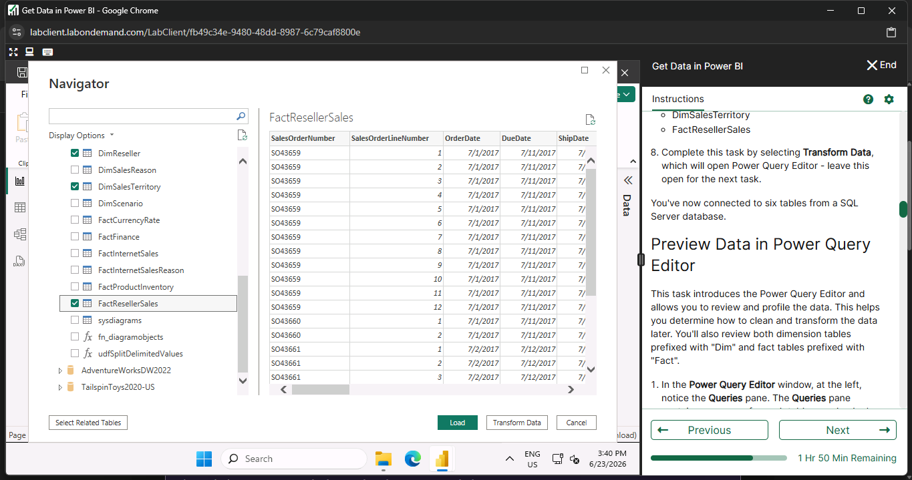
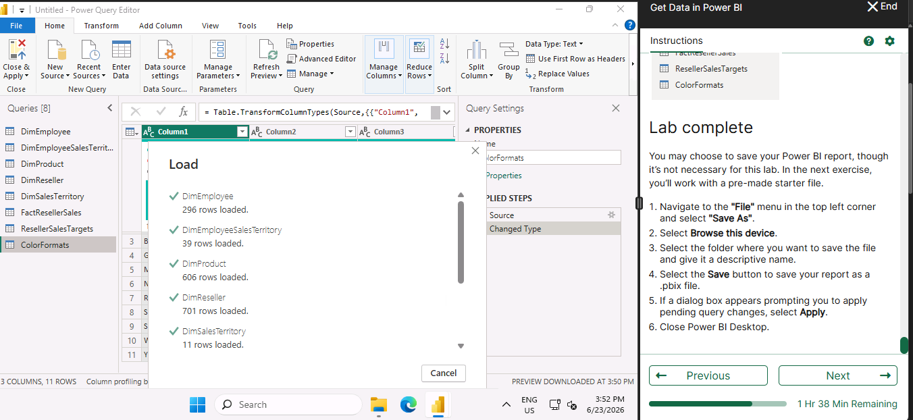

# Get data in Power BI - Microsoft module

## Senario : Data Analysis for Tailwind Traders
1. SQL Server has items each customer baught and when and which employee made the sale
2. Excel sheets have Employee hire date, tittle, and their manager
3. JSON file has shipments
4. Microsoft azure has financial pojections

## Get data from Excel
Get data > Excel workbook > Navigate to the file > Select 'Sales Target' > Load

   

---

## Get data from SQL Server
First we will create a dummy databse

Get data > SQL Server > Provide Server Name > Select Database > Select Table > Load

# Selecting a Storage mode

The most popular way to use data in Power BI is to import it into a Power BI semantic model. However, this approach might not work for all organizations.

The three different types of storage modes you can choose from:

1. Import
2. DirectQuery
3. Dual (Composite)

# Fixing Performance Issues

## 1. Query folding : 

Consider a scenario where you’ve renamed a few columns in the Sales data and merged a city and state column together in the “city state” format. Meanwhile, the query folding feature tracks those changes in native queries. Then, when you load your data, the transformations take place independently in the original source, this ensures that performance is optimized in Power BI.

## 2. Query Diagnostics

Power Query diagnostics is a feature that allows you to analyze and optimize the performance of your Power Query queries.

# Resolving Data import errors

## 1. Query time out error

### Reason : 
Pulled too much data according to your companies policy (The timeout time can be configured to be 30 mins or even more by the company)

### Solutions :

1. Pulling fewer columns or rows from a single table
2. In sql include grouping and aggregations and joins

## 2. "We couldn't find any data formatted as a table"

### Reason :
Excel sheet has no tabular format

### Solution:
Verify coulumn headers

## 3. Couldn't find File

### Reason / Solution :
1. File is moved or deleted
2. File is renamed
3. File is not in the expected location

## 4. Data type errors (columns appear blank)

if you're importing data from SQL Server and see blank columns, you could try to convert to the correct data type in the query.

Instead of using this query:

SELECT CustomerPostalCode FROM Sales.Customers

Use this query:

SELECT CAST(CustomerPostalCode as varchar(10)) FROM Sales.Customers

By specifying the correct type at the data source, you eliminate many of these common data source errors.

# Activity

