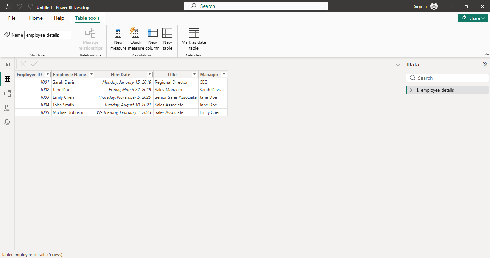
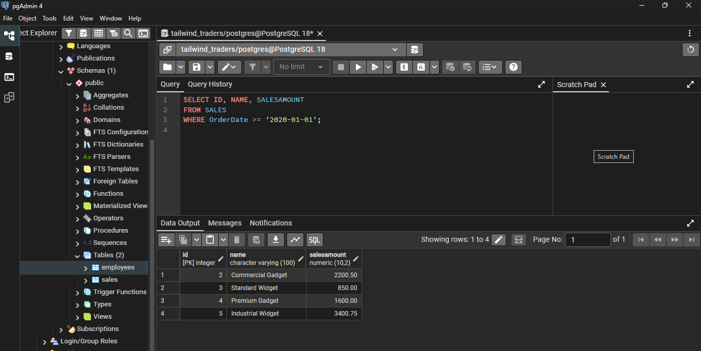
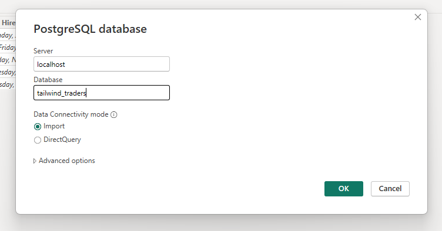
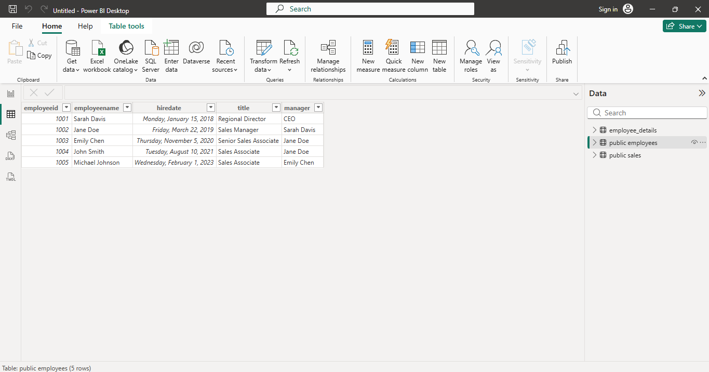

# Get data in Power BI - Microsoft module

## Senario : Data Analysis for Tailwind Traders
1. SQL Server has items each customer baught and when and which employee made the sale
2. Excel sheets have Employee hire date, tittle, and their manager
3. JSON file has shipments
4. Microsoft azure has financial pojections

## Get data from Excel
Get data > Excel workbook > Navigate to the file > Select 'Sales Target' > Load

   

---

## Get data from SQL Server
First we will create a dummy databse

Get data > SQL Server > Provide Server Name > Select Database > Select Table > Load

## Create Dynamic reports with parameters
